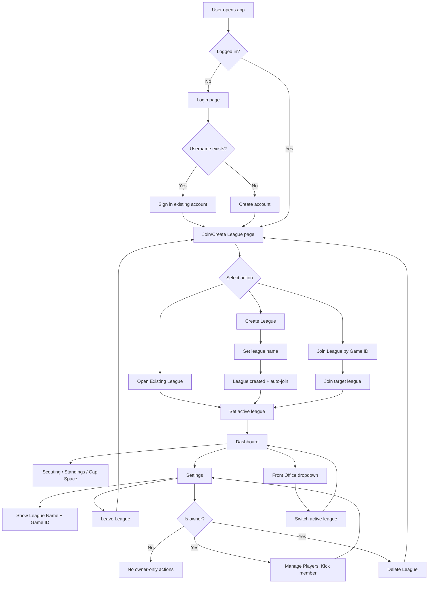

# BananaBall App Workflow

```mermaid
flowchart TD
    A[User opens app] --> B{Logged in?}
    B -- No --> C[Login page]
    C --> D{Username exists?}
    D -- Yes --> E[Sign in existing account]
    D -- No --> F[Create account]
    E --> G[Join/Create League page]
    F --> G

    B -- Yes --> G

    G --> H{Select action}
    H --> I[Create League]
    H --> J[Join League by Game ID]
    H --> K[Open Existing League]

    I --> L[Set league name]
    L --> M[League created + auto-join]
    J --> N[Join target league]
    K --> O[Set active league]
    M --> O
    N --> O

    O --> P[Dashboard]
    P --> Q[Scouting / Standings / Cap Space]
    P --> R[Settings]

    R --> S[Show League Name + Game ID]
    R --> T[Leave League]
    R --> U{Is owner?}
    U -- Yes --> V[Delete League]
    U -- Yes --> W[Manage Players: Kick member]
    U -- No --> X[No owner-only actions]

    T --> G
    V --> G
    W --> R

    P --> Y[Front Office dropdown]
    Y --> Z[Switch active league]
    Z --> P
```

